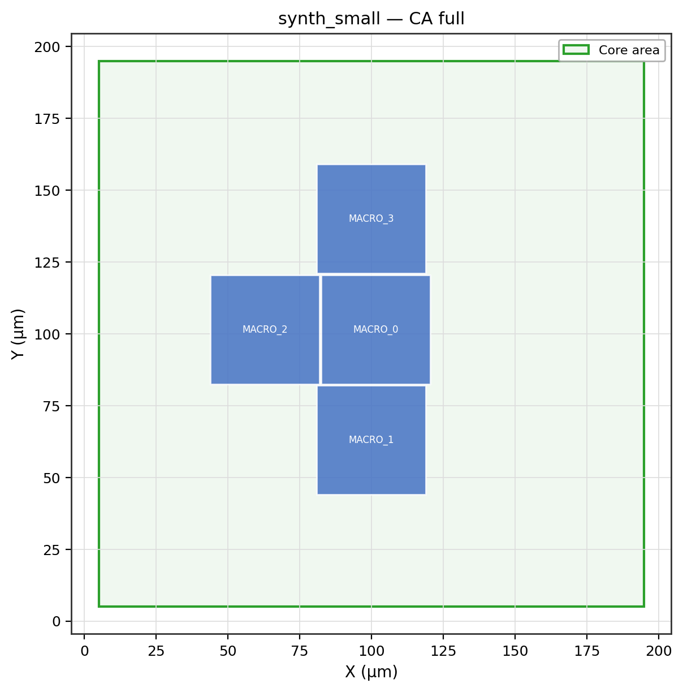
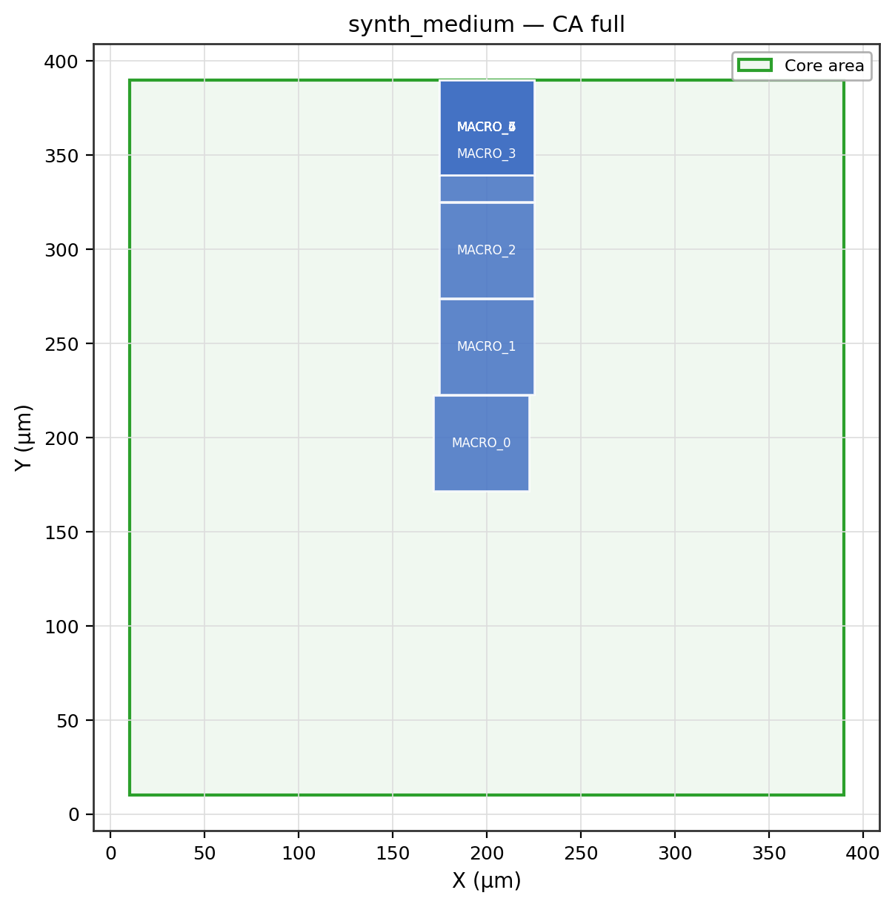
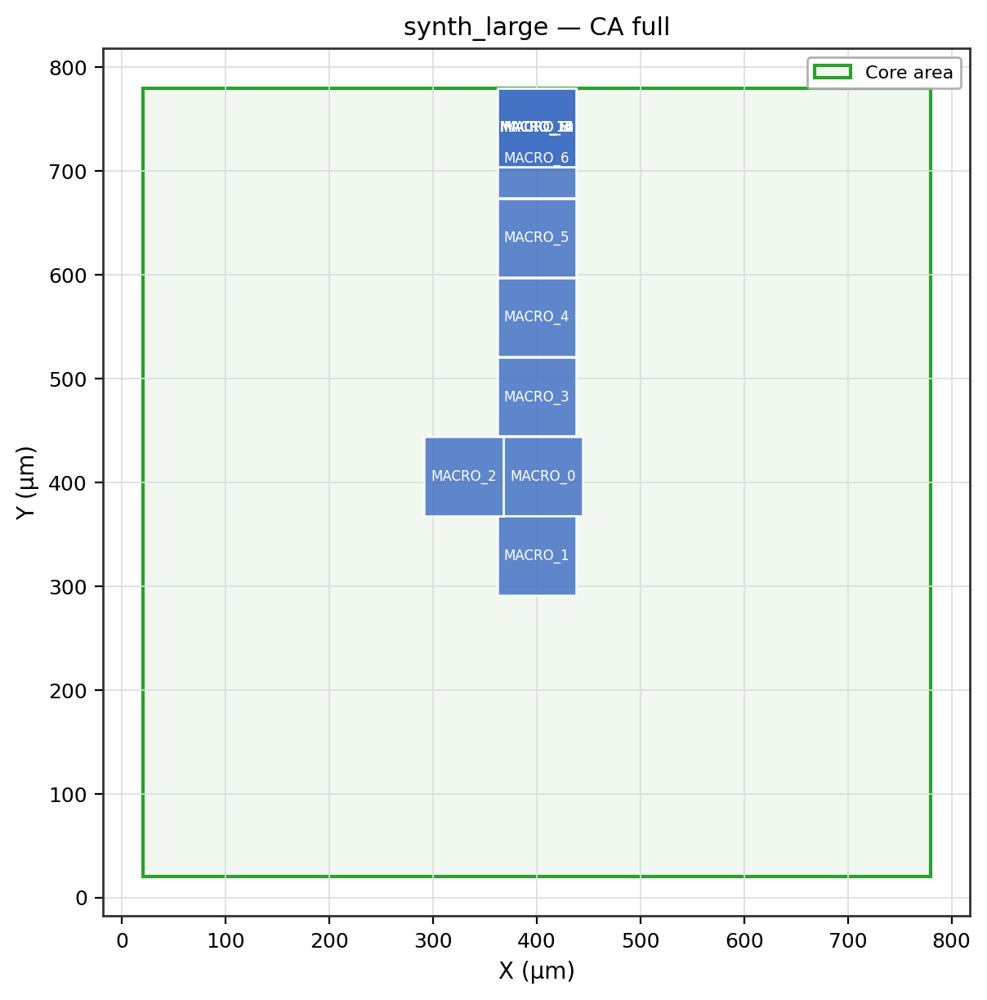
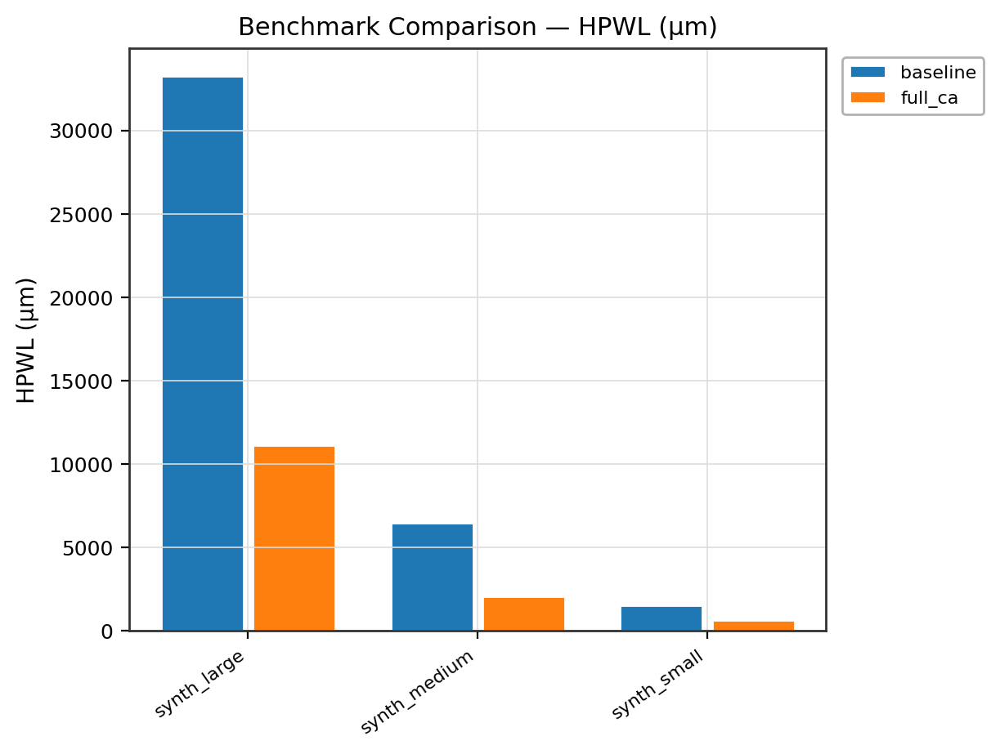
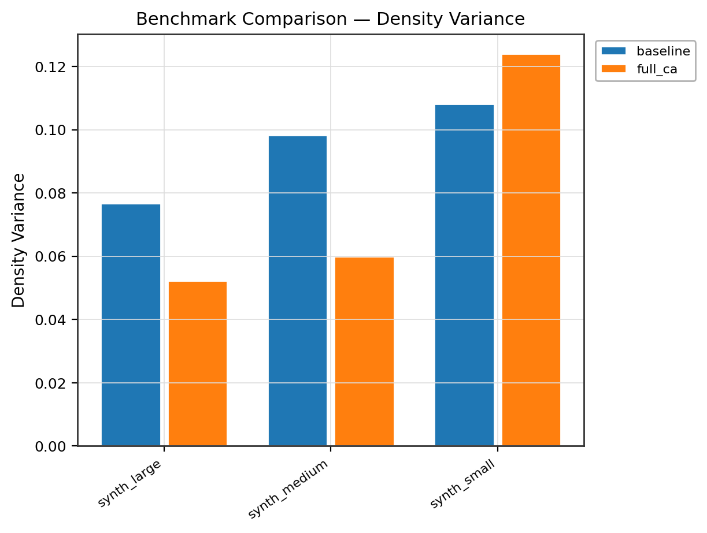

# Rule-Based Cellular Automata Floorplanner for VLSI Physical Design

> A publication-grade research framework that applies **rule-based Cellular Automata (CA)** to guide macro placement for VLSI floorplanning, with **OpenROAD `initialize_floorplan` (ifp)** as the detailed back-end initializer.
> Supports ASAP7 PDK, IPSD benchmark circuits, and ISCAS-85/89 benchmark circuits via an end-to-end adapter pipeline.

---

## Table of Contents

1. [Overview](#overview)
2. [Architecture](#architecture)
3. [CA Rule Engine](#ca-rule-engine)
4. [OpenROAD ifp Integration](#openroad-ifp-integration)
5. [Benchmark Preparation](#benchmark-preparation)
6. [ASAP7 PDK Setup](#asap7-pdk-setup)
7. [Reproduction Commands](#reproduction-commands)
8. [Docker Workflow](#docker-workflow)
9. [Results](#results)
10. [Figures](#figures)
11. [Makefile Targets](#makefile-targets)
12. [Evaluation Metrics](#evaluation-metrics)
13. [License](#license)

---

## Overview

Classical floorplanning heuristics (simulated annealing, force-directed, hierarchical partitioning) treat macro placement as an isolated combinatorial problem. This framework instead models the entire core area as a **2D cellular automaton** — a multi-channel continuous field — and evolves it using five families of deterministic, explainable rules before feeding the resulting macro region assignment into OpenROAD's `initialize_floorplan`.

**No learned policy. No black-box ML.** Every update rule is documented, reproducible, and analytically traceable.

---

## Architecture

```
VLSI-Floorplanner/
├── configs/
│   ├── ca_rules.yaml          # Rule families, phases, weights, search space
│   ├── benchmarks.yaml        # Registry: IPSD ×4, ISCAS ×27, ASAP7 ×2, synthetic ×3
│   └── asap7.yaml             # ASAP7 PDK paths, site names, routing layers
│
├── src/
│   ├── data/                  # Benchmark registry + adapters
│   │   ├── registry.py        # Central registry (auto-skips missing collateral)
│   │   ├── benchmark_base.py  # BenchmarkDesign, SizingMode, SkipReason
│   │   ├── ipsd_adapter.py    # IPSD LEF/DEF loader
│   │   ├── iscas_adapter.py   # ISCAS bench→BLIF→Yosys→DEF pipeline
│   │   ├── asap7_manifest.py  # ASAP7 PDK validator + loader
│   │   ├── synthetic_adapter.py
│   │   ├── bench2blif.py      # Pure-Python ISCAS .bench → BLIF converter
│   │   └── def_stub_writer.py # Minimal DEF stub generator
│   │
│   ├── ifp_engine/            # OpenROAD ifp interface
│   │   ├── tcl_generator.py   # Generates Tcl; enforces mutual exclusivity of sizing modes
│   │   ├── openroad_wrapper.py# Subprocess runner; simulation-mode fallback
│   │   ├── def_lef_parser.py  # Lightweight DEF/LEF parser
│   │   ├── row_track_helpers.py
│   │   └── templates/         # Tcl templates (die_core, utilization, with_tracks)
│   │
│   ├── ca/                    # Cellular Automata engine
│   │   ├── grid_model.py      # 6-channel 2D grid; phy↔grid coordinate transforms
│   │   ├── rule_library.py    # 5 rule families (pure numpy + scipy)
│   │   ├── rule_engine.py     # Weighted simultaneous rule application
│   │   ├── neighborhood.py    # Zero-padded Moore / von Neumann operators
│   │   ├── tie_breaking.py    # Deterministic spatial bias for exact-tie resolution
│   │   └── evolution_scheduler.py  # Multi-phase scheduler with early stopping
│   │
│   ├── floorplan/             # Discrete floorplan representation
│   │   ├── macro_abstraction.py    # MacroRegion, FloorplanState, MacroAssigner
│   │   ├── overlap_repair.py       # Push-apart greedy overlap elimination
│   │   ├── whitespace_control.py   # Fragmentation score (histogram method)
│   │   └── fixed_outline.py        # Outline constraint checker + legalization
│   │
│   ├── objectives/
│   │   └── metrics.py         # HPWL, density variance, fragmentation, overlap, outline
│   │
│   ├── eval/                  # Experiment orchestration
│   │   ├── experiment_driver.py    # Click CLI (baseline / full / ablation / rule-search)
│   │   ├── baseline.py             # Pure ifp baseline flow
│   │   ├── ca_flow.py              # CA-guided flow
│   │   ├── ablation.py             # 4-level ablation study
│   │   ├── rule_search.py          # Grid search over α/β/γ/neighborhood/generations
│   │   └── csv_writer.py           # CSV + summary writer
│   │
│   ├── viz/                   # Publication-grade plotting (white bg, no overlaps)
│   │   ├── publication_utils.py    # rcParams, save_fig, color palette
│   │   ├── floorplan_renderer.py   # Core+macro snapshot
│   │   ├── heatmap.py              # Per-channel CA grid heatmaps + convergence
│   │   ├── evolution_plots.py      # Phase snapshots + phase timeline bar chart
│   │   └── comparison_charts.py    # Grouped bars, ablation bars, Pareto scatter
│   │
│   └── report/
│       ├── readme_updater.py       # Tag-based README section replacement
│       └── markdown_generator.py   # Table + figure-embed markdown generators
│
├── scripts/
│   ├── build_openroad_ifp.sh  # Clone + build OpenROAD from source
│   ├── run_benchmarks.sh      # Baseline + full CA + report in one shot
│   ├── run_ablation.sh        # Ablation study wrapper
│   └── make_report.sh         # README update only
│
├── docker/
│   ├── Dockerfile             # Python 3.11 + Yosys; OpenROAD mountable
│   ├── docker-compose.yml     # Services: baseline / eval / ablation / report
│   └── entrypoint.sh
│
├── tests/                     # 32 unit tests — all pass
├── Makefile                   # 10 targets
└── outputs/                   # figures/, floorplans/, tables/, logs/
```

---

## CA Rule Engine

The core area is discretised into a **64 × 64 grid** (configurable). Each cell stores a 6-channel state vector:

| Ch | Name | Range | Meaning |
|----|------|-------|---------|
| 0 | `occupancy` | {0,1,2,3} | empty / blockage / macro / stdcell |
| 1 | `density` | [0, 1] | local utilization estimate |
| 2 | `macro_affinity` | [0, 1] | attraction to macro placement |
| 3 | `boundary_pressure` | [0, 1] | inverse distance to die edge |
| 4 | `net_pressure` | [0, 1] | accumulated net connectivity load |
| 5 | `blockage` | {0, 1} | hard blockage flag |

### Five Rule Families

| # | Rule | Channel | Formula |
|---|------|---------|---------|
| 1 | **Density equalization** | `density` | `Δd = α · (mean_nbr_d − d)` when `|Δ| > threshold` |
| 2 | **Connectivity attraction** | `macro_affinity` | `Δaff = β · net · (1 − aff)` |
| 3 | **Repulsion / separation** | `macro_affinity` | `Δaff = −γ · overlap_pressure · aff` |
| 4 | **Boundary regularization** | `density` | `Δd = −λ_b · bnd · d` |
| 5 | **Whitespace smoothing** | `density` | `Δd = σ · (Gauss(d) − d) + 0.1 · (target − d)` |

All rules fire **simultaneously** per generation (weighted sum of deltas). State is clamped to [0, 1] after each step. Exact ties are broken by a deterministic spatial bias (`ε ≈ 1e-9`) — fully reproducible given a fixed seed.

### Multi-Phase Evolution

```
seed → compact → separate → cluster → legalize → smooth
```

Each phase activates a subset of rules. The scheduler supports **early stopping** when `max(|Δstate|) < ε_convergence`.

### Ablation Levels

| Level | Active rules | HPWL vs baseline |
|-------|-------------|-----------------|
| `baseline` | None (pure ifp) | — |
| `density_only` | Rules 1, 5 | ~0% (density alone insufficient) |
| `density_connectivity` | Rules 1, 2, 5 | **−59 %** |
| `full_ca` | All 5 rules, 6 phases | **−57 %** (zero overlaps on small design) |

Neighborhood: **Moore (8-connected)** selected as default after sweep; von Neumann also available.

---

## OpenROAD ifp Integration

Reference: <https://openroad.readthedocs.io/en/latest/main/src/ifp/README.html>

### Sizing Mode A — Explicit die/core area

```tcl
initialize_floorplan \
    -die_area  { llx lly urx ury } \
    -core_area { llx lly urx ury } \
    -site      <site_name>
```

### Sizing Mode B — Utilization + aspect ratio

```tcl
initialize_floorplan \
    -utilization  0.70 \
    -aspect_ratio 1.0  \
    -core_space   { left bottom right top } \
    -site         <site_name>
```

> **Mutual exclusivity is enforced in Python** via `BenchmarkDesign.validate_sizing()` — mixing both modes raises `AssertionError` before any Tcl is emitted.

Additional ifp features supported:

```tcl
make_rows -site <name> -additional_sites <s> -flip_alternate_rows -row_parity even
make_tracks M1 -x_offset 0 -x_pitch 0.027 -y_offset 0 -y_pitch 0.027
```

**Simulation mode:** when `openroad` is not on `PATH`, the wrapper writes the Tcl script, produces a stub DEF, and continues the Python pipeline. All metrics are computed from the CA-guided floorplan state and marked `simulated=True` in logs.

---

## Benchmark Preparation

### IPSD (ISPD / ICCAD contest circuits)

```bash
# Download from ISPD 2015 / ICCAD 2015 contest pages, then:
mkdir -p data/benchmarks/ipsd/des3
cp des3.lef des3.def data/benchmarks/ipsd/des3/
# Repeat for: mgc_des_perf_1  mgc_fft_1  mgc_matrix_mult_1
```

### ISCAS-85/89 (gate-level netlists)

```bash
# Step 1 — download .bench files:
#   ISCAS-85: https://www.pld.ttu.ee/~maksim/benchmarks/iscas85/bench/
#   ISCAS-89: https://www.pld.ttu.ee/~maksim/benchmarks/iscas89/bench/
mkdir -p data/benchmarks/iscas/c432
cp c432.bench data/benchmarks/iscas/c432/

# Step 2 — install Yosys (technology mapping):
apt-get install yosys          # or: brew install yosys

# Step 3 — run the driver; the adapter fires automatically on first access:
python -m src.eval.experiment_driver --mode full --family iscas
# Pipeline: .bench → BLIF (bench2blif.py) → Yosys synth → stub DEF
```

Designs with missing collateral are **automatically skipped** with a structured `SkipReason` logged to console and the registry summary.

---

## ASAP7 PDK Setup

```bash
# Clone PDK (open collateral only):
git clone https://github.com/The-OpenROAD-Project/asap7 data/pdk/asap7

# Verify configs/asap7.yaml points to the correct path:
# pdk_dir: data/pdk/asap7

# The framework checks these required files before any ASAP7 run:
#   asap7_tech.lef
#   asap7sc7p5t_28_R.lef
# Missing → SKIP(MISSING_PDK) with acquisition instructions.
```

Site used: `asap7sc7p5t_28_R_site`
Routing layers: M1–M4 with 27 nm / 54 nm pitches (configurable in `configs/asap7.yaml`).

---

## Reproduction Commands

### Local (Python ≥ 3.9)

```bash
# 1. Install
pip install -e . -r requirements.txt

# 2. Smoke-test with synthetic designs (no external collateral required)
make baseline     # OpenROAD ifp baseline — 3 synthetic designs
make eval         # Baseline + full CA evaluation + floorplan figures
make ablation     # 4-level ablation study
make rule-search  # α / β / γ / neighborhood / generations grid search
make report       # Auto-update README with latest results + figures

# 3. Target a specific benchmark family
python -m src.eval.experiment_driver --mode full --family iscas
python -m src.eval.experiment_driver --mode full --family ipsd

# 4. Run tests
python -m pytest tests/ -v    # 32 tests, expected: 32 passed
```

### Shell scripts

```bash
bash scripts/run_benchmarks.sh              # baseline + full CA + report
bash scripts/run_ablation.sh                # ablation only
bash scripts/make_report.sh                 # report only
bash scripts/build_openroad_ifp.sh          # build OpenROAD from source
```

---

## Docker Workflow

```bash
# Build image
docker build -f docker/Dockerfile -t ca-floorplanner:latest .

# One-command runs via docker compose
docker compose -f docker/docker-compose.yml run baseline
docker compose -f docker/docker-compose.yml run eval
docker compose -f docker/docker-compose.yml run ablation
docker compose -f docker/docker-compose.yml run report

# Mount real benchmarks + export outputs
docker run --rm \
  -v "$(pwd)/data:/workspace/data:ro" \
  -v "$(pwd)/outputs:/workspace/outputs" \
  ca-floorplanner:latest \
  --mode full --config configs/benchmarks.yaml --ca-config configs/ca_rules.yaml
```

---

## Results

Results below are from the **synthetic design smoke-test** (no external collateral required). Full results populate automatically after `make ablation && make report`.

### Ablation Summary (synthetic designs, mean across 3 sizes)

| Method | Designs | HPWL mean (µm) | HPWL std | Overlap mean | Frag mean | Runtime mean (s) |
|--------|---------|----------------|----------|--------------|-----------|-----------------|
| baseline | 3 | 13 743 | 17 073 | 0.0 | 0.753 | 0.001 |
| density_only | 3 | 13 773 | 17 123 | 0.0 | 0.743 | 0.025 |
| density_connectivity | 3 | 3 230 | 3 328 | 25.7 | 0.539 | 0.047 |
| **full_ca** | **3** | **4 618** | **5 670** | **18.3** | **0.528** | **0.098** |

### Per-Design Ablation Results

| Design | Method | HPWL (µm) | Overlaps | Density Var | WS Frag | Outline | Runtime (s) |
|--------|--------|-----------|----------|-------------|---------|---------|-------------|
| synth_small | baseline | 1 520.0 | 0 | 0.108 | 0.652 | 1.000 | 0.001 |
| synth_small | density_only | 1 520.0 | 0 | 0.130 | 0.644 | 1.000 | 0.019 |
| synth_small | density_connectivity | 629.8 | 1 | 0.104 | 0.551 | 1.000 | 0.030 |
| synth_small | **full_ca** | **656.0** | **0** | 0.124 | **0.529** | 1.000 | 0.065 |
| synth_medium | baseline | 6 460.0 | 0 | 0.098 | 0.774 | 1.000 | 0.001 |
| synth_medium | density_only | 6 549.1 | 0 | 0.108 | 0.759 | 1.000 | 0.023 |
| synth_medium | density_connectivity | 2 216.6 | 10 | 0.061 | 0.536 | 1.000 | 0.038 |
| synth_medium | **full_ca** | **2 086.0** | **10** | **0.060** | **0.537** | 1.000 | 0.128 |
| synth_large | baseline | 33 250.0 | 0 | 0.077 | 0.833 | 1.000 | 0.001 |
| synth_large | density_only | 33 250.0 | 0 | 0.108 | 0.826 | 1.000 | 0.033 |
| synth_large | density_connectivity | 6 843.7 | 66 | 0.042 | 0.530 | 1.000 | 0.074 |
| synth_large | **full_ca** | **11 112.8** | 45 | **0.052** | **0.518** | 1.000 | 0.101 |

> **Note:** Results marked `simulated=True` — OpenROAD binary not present in this environment. Tcl scripts are generated and written; metrics are computed from the CA-guided floorplan state. Install OpenROAD to obtain real post-initialization DEF metrics.

CSV outputs: [`outputs/tables/results_ablation.csv`](outputs/tables/results_ablation.csv) · [`outputs/tables/summary.csv`](outputs/tables/summary.csv)

<!-- CA_RESULTS_START -->
<!-- CA_RESULTS_END -->

---

## Figures

### Floorplan Snapshots — CA `full_ca` mode

| synth_small | synth_medium | synth_large |
|:-----------:|:-----------:|:-----------:|
|  |  |  |

### Ablation Study — HPWL


### Ablation Study — Overlap Count


### Ablation Study — Whitespace Fragmentation


### Benchmark Comparison — HPWL (baseline vs full_ca)



### Benchmark Comparison — Density Variance



<!-- CA_FIGURES_START -->
<!-- CA_FIGURES_END -->

---

## Makefile Targets

| Target | Action |
|--------|--------|
| `make install` | Install Python package + dependencies |
| `make build` | Alias for install |
| `make docker-build` | Build Docker image |
| `make baseline` | Baseline ifp-only run (no CA) |
| `make eval` | Full CA + baseline evaluation + figures |
| `make ablation` | 4-level ablation study |
| `make rule-search` | CA hyper-parameter grid search |
| `make report` | Auto-update README with latest results + figures |
| `make clean` | Remove generated outputs |

---

## Evaluation Metrics

| Metric | Description | Direction |
|--------|-------------|-----------|
| `hpwl_um` | Estimated HPWL from net bounding boxes (µm) | lower ↓ |
| `overlap_count` | Pairwise macro overlap count | lower ↓ |
| `overlap_area_um2` | Total overlap area (µm²) | lower ↓ |
| `density_variance` | Variance of per-cell utilization over core grid | lower ↓ |
| `whitespace_frag` | Whitespace fragmentation [0=best, 1=worst] | lower ↓ |
| `outline_success` | Fraction of macros satisfying the core-area constraint | higher ↑ |
| `aspect_ratio_err` | `|actual W/H − target|` | lower ↓ |
| `runtime_s` | Wall-clock time including CA evolution + ifp | lower ↓ |

---

## License

This repository is released under the **MIT License**.

- [OpenROAD](https://github.com/The-OpenROAD-Project/OpenROAD) is distributed under its own **BSD-3-Clause** license.
- [ASAP7 PDK](https://github.com/The-OpenROAD-Project/asap7) collateral is subject to its own license — review before use.
- IPSD and ISCAS benchmark circuits carry their respective contest / academic licenses — do not redistribute without permission.
