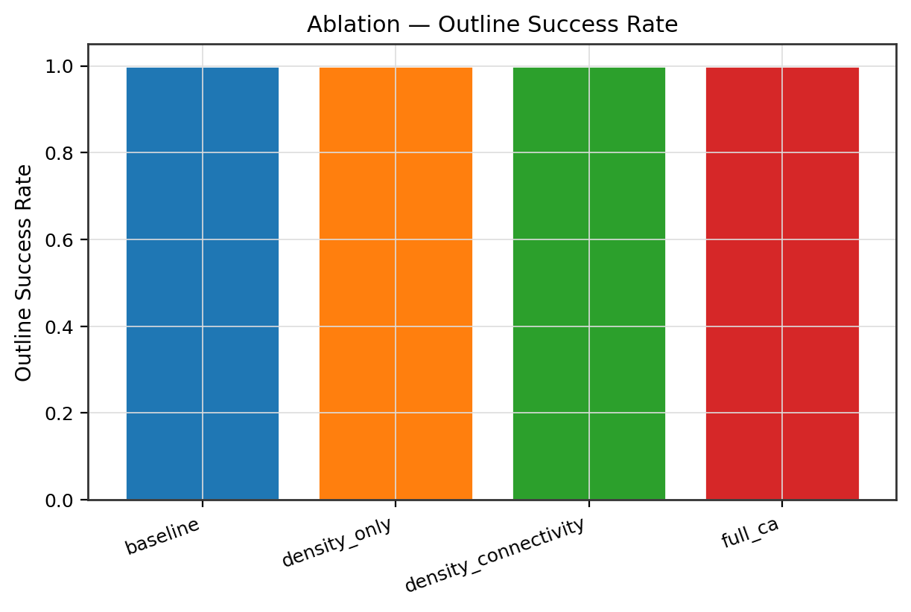
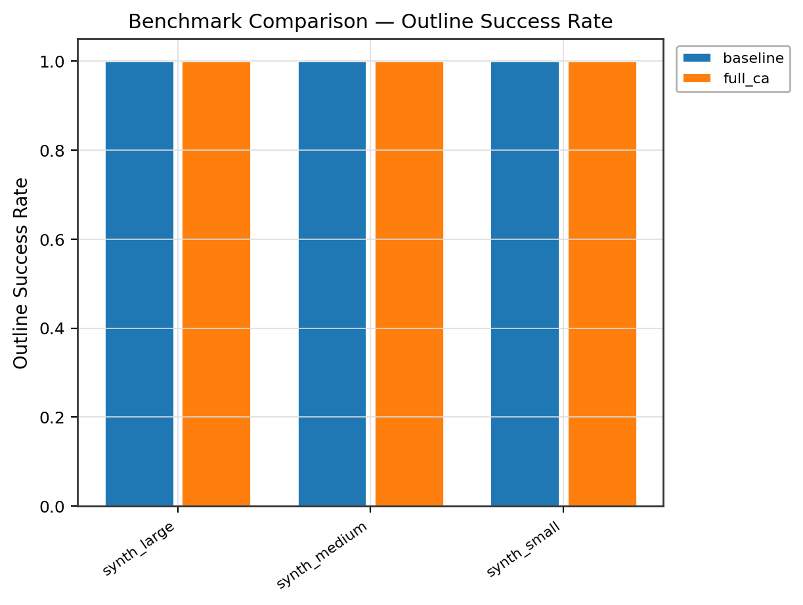
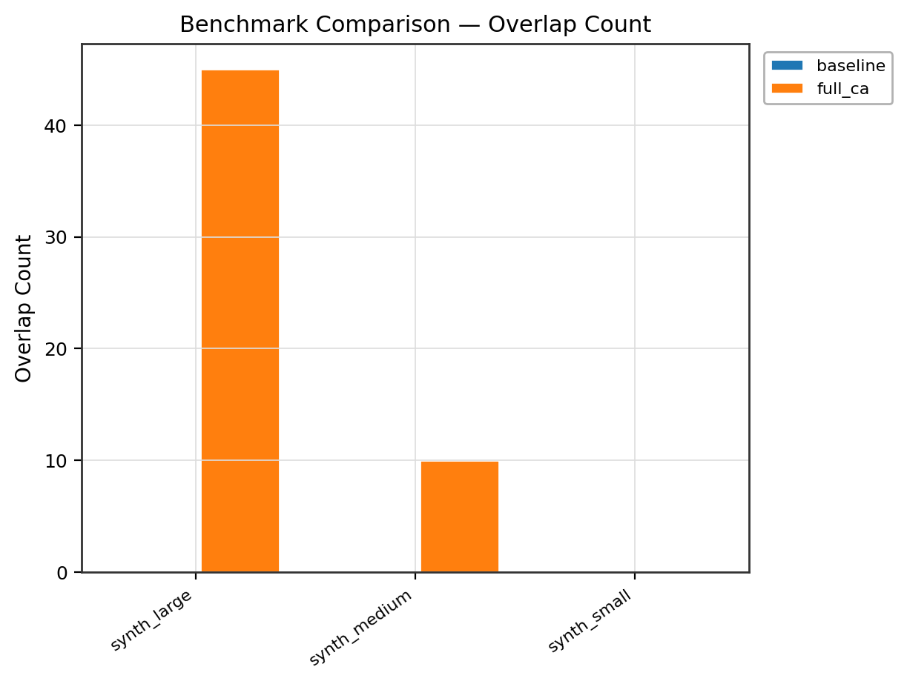
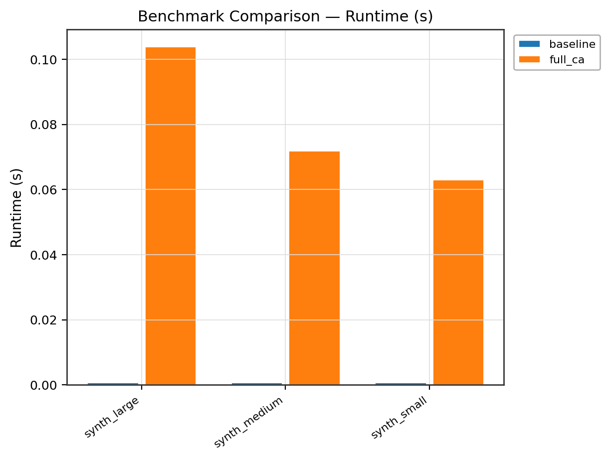
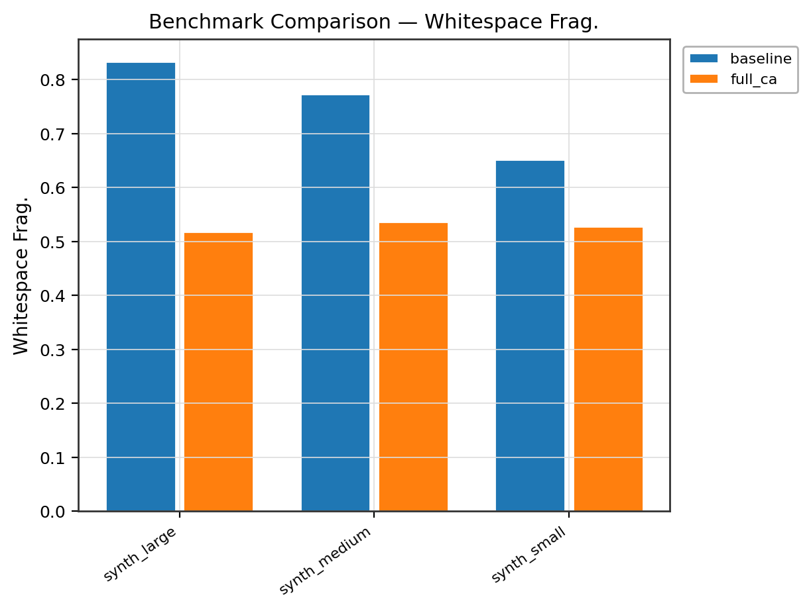

# Rule-Based Cellular Automata Floorplanner for VLSI Physical Design

A research framework that applies rule-based Cellular Automata (CA) to guide VLSI floorplanning, with OpenROAD `initialize_floorplan` (ifp) as the detailed back-end. Supports ASAP7 PDK, IPSD benchmark circuits, and ISCAS-85/89 circuits via an adapter pipeline.

---

## Architecture

```
configs/           CA rule configs, benchmark registry, ASAP7 PDK config
src/
  data/            Benchmark registry, IPSD/ISCAS/ASAP7 adapters, synthetic generator
  ifp_engine/      OpenROAD ifp wrapper, Tcl generator (die/core + util modes), DEF/LEF parser
  ca/              Grid model, 5-rule library, rule engine, evolution scheduler, neighborhoods
  floorplan/       Macro abstraction, overlap repair, whitespace control, fixed-outline checker
  objectives/      Metric computation: HPWL, density variance, fragmentation, overlap, outline
  eval/            Baseline + CA flows, ablation study driver, rule-search sweeper, CSV writer
  viz/             White-background floorplan renderer, heatmaps, evolution plots, bar charts
  report/          README auto-updater, markdown table generator
scripts/           Shell wrappers for benchmark runs, ablation, report generation
docker/            Dockerfile + docker-compose for fully reproducible one-command runs
outputs/           figures/, floorplans/, tables/, logs/, reports/
tests/             32 unit tests (CA grid, rules, Tcl generator, floorplan, metrics)
```

---

## CA Rule Summary

Five deterministic rule families evolve a 6-channel 2D grid (64×64 by default):

| # | Rule | Channel affected | Logic |
|---|------|-----------------|-------|
| 1 | **Density equalization** | `density` | Redistribute utilization mass toward low-density neighbors: `Δd = α(mean_nbr − d)` when `|Δ| > threshold` |
| 2 | **Connectivity attraction** | `macro_affinity` | Pull high net-pressure regions toward macro zones: `Δaff = β · net · (1 − aff)` |
| 3 | **Repulsion / separation** | `macro_affinity` | Reduce affinity near macro-dense neighborhoods: `Δaff = −γ · overlap_pressure · aff` |
| 4 | **Boundary regularization** | `density` | Push utilization away from die edges: `Δd = −λ_b · bnd · d` |
| 5 | **Whitespace smoothing** | `density` | Gaussian-smooth density toward target utilization |

Evolution runs in six sequential phases: **seed → compact → separate → cluster → legalize → smooth**.  
Neighborhoods: Moore (8-connected) or von Neumann (4-connected), selectable per experiment.  
All runs are deterministic given a fixed seed (default 42).

### Ablation levels

| Level | Rules active |
|-------|-------------|
| `baseline` | None (pure OpenROAD ifp) |
| `density_only` | Rule 1 + 5 |
| `density_connectivity` | Rules 1, 2, 5 |
| `full_ca` | All 5 rules, 6 phases |

---

## OpenROAD ifp Integration

Ref: <https://openroad.readthedocs.io/en/latest/main/src/ifp/README.html>

Two **mutually exclusive** sizing modes are enforced in code:

**Mode A — explicit die/core area:**
```tcl
initialize_floorplan \
    -die_area  { llx lly urx ury } \
    -core_area { llx lly urx ury } \
    -site      <site_name>
```

**Mode B — utilization + aspect ratio:**
```tcl
initialize_floorplan \
    -utilization  0.70 \
    -aspect_ratio 1.0  \
    -core_space   { L B R T } \
    -site         <site_name>
```

`make_rows` and `make_tracks` are generated conditionally (hybrid-row / PDK-aware flows).  
If OpenROAD is not on `PATH`, the runner enters **simulation mode**: Tcl scripts are written, a stub DEF is produced, and the Python pipeline continues — results are marked `simulated=True`.

---

## Benchmark Preparation

### IPSD (ISPD / ICCAD contest circuits)
```
# Download contest archives from the ISPD/ICCAD contest pages, then:
mkdir -p data/benchmarks/ipsd/des3
cp des3.lef des3.def data/benchmarks/ipsd/des3/
# Repeat for mgc_des_perf_1, mgc_fft_1, mgc_matrix_mult_1
```

### ISCAS-85/89 (gate-level netlists)
```bash
# 1. Download .bench files:
#    https://www.pld.ttu.ee/~maksim/benchmarks/iscas85/bench/
#    https://www.pld.ttu.ee/~maksim/benchmarks/iscas89/bench/
mkdir -p data/benchmarks/iscas/c432
cp c432.bench data/benchmarks/iscas/c432/

# 2. Install Yosys (required for tech-mapping):
apt-get install yosys

# 3. The adapter converts .bench → BLIF → Verilog → stub DEF automatically.
#    Run the driver and the pipeline fires on first access.
```

### ASAP7 PDK
```bash
git clone https://github.com/The-OpenROAD-Project/asap7 data/pdk/asap7
# Then set pdk_dir in configs/asap7.yaml to data/pdk/asap7
# The framework validates required files before any ASAP7 run.
```

Designs that are missing collateral are automatically **skipped** with a clear reason logged and written to the registry summary.

---

## Reproduction Commands

### Local (Python ≥ 3.9)
```bash
# Install
pip install -e . -r requirements.txt

# Smoke-test with synthetic designs (no external collateral needed)
make baseline   # OpenROAD ifp baseline, synthetic designs
make eval       # full CA flow
make ablation   # all 4 ablation levels
make report     # update README with results + figures

# With a specific benchmark family
python -m src.eval.experiment_driver --mode full --family iscas

# Rule search (parameter sweep)
python -m src.eval.experiment_driver --mode rule-search

# Tests
python -m pytest tests/ -v
```

### Docker (one-command)
```bash
# Build
docker build -f docker/Dockerfile -t ca-floorplanner:latest .

# Or with docker compose:
docker compose -f docker/docker-compose.yml run baseline
docker compose -f docker/docker-compose.yml run ablation
docker compose -f docker/docker-compose.yml run report
```

Mount real benchmarks:
```bash
docker run --rm \
  -v $(pwd)/data:/workspace/data:ro \
  -v $(pwd)/outputs:/workspace/outputs \
  ca-floorplanner:latest \
  --mode full --config configs/benchmarks.yaml
```

---

## Results

<!-- CA_RESULTS_START -->
| method | designs | hpwl_mean | hpwl_std | overlap_mean | frag_mean | runtime_mean |
| --- | --- | --- | --- | --- | --- | --- |
| baseline | 3 | 13743.333 | 17072.886 | 0.000 | 0.753 | 0.001 |
| full_ca | 3 | 4618.238 | 5669.677 | 18.333 | 0.528 | 0.101 |

**Full results:**

| design | method | hpwl_um | overlap_count | density_variance | whitespace_frag | outline_success | runtime_s |
| --- | --- | --- | --- | --- | --- | --- | --- |
| synth_small | baseline | 1520.000 | 0 | 0.108 | 0.652 | 1.000 | 0.001 |
| synth_medium | baseline | 6460.000 | 0 | 0.098 | 0.774 | 1.000 | 0.001 |
| synth_large | baseline | 33250.000 | 0 | 0.077 | 0.833 | 1.000 | 0.001 |
| synth_small | density_only | 1520.000 | 0 | 0.130 | 0.644 | 1.000 | 0.020 |
| synth_medium | density_only | 6549.062 | 0 | 0.108 | 0.759 | 1.000 | 0.052 |
| synth_large | density_only | 33250.000 | 0 | 0.108 | 0.826 | 1.000 | 0.028 |
| synth_small | density_connectivity | 629.812 | 1 | 0.104 | 0.551 | 1.000 | 0.031 |
| synth_medium | density_connectivity | 2216.604 | 10 | 0.061 | 0.536 | 1.000 | 0.056 |
| synth_large | density_connectivity | 6843.688 | 66 | 0.042 | 0.530 | 1.000 | 0.080 |
| synth_small | full_ca | 655.984 | 0 | 0.124 | 0.529 | 1.000 | 0.077 |
| synth_medium | full_ca | 2085.979 | 10 | 0.060 | 0.537 | 1.000 | 0.077 |
| synth_large | full_ca | 11112.750 | 45 | 0.052 | 0.518 | 1.000 | 0.098 |

<!-- CA_RESULTS_END -->

---

## Figures

<!-- CA_FIGURES_START -->










<!-- CA_FIGURES_END -->

---

## Makefile Targets

| Target | Action |
|--------|--------|
| `make install` | Install Python package + dependencies |
| `make build` | Alias for install |
| `make docker-build` | Build Docker image |
| `make baseline` | Baseline ifp-only run |
| `make eval` | Full CA + baseline evaluation |
| `make ablation` | 4-level ablation study |
| `make rule-search` | CA hyper-parameter sweep |
| `make report` | Update README with latest results |
| `make clean` | Remove generated outputs |

---

## Evaluation Metrics

| Metric | Description |
|--------|-------------|
| `hpwl_um` | Estimated half-perimeter wirelength (µm) from net bounding boxes |
| `overlap_count` | Number of pairwise macro overlaps |
| `overlap_area_um2` | Total overlap area (µm²) |
| `density_variance` | Variance of per-cell utilization over core grid |
| `whitespace_frag` | Whitespace fragmentation score [0=best, 1=worst] |
| `outline_success` | Fraction of macros satisfying core-area constraint |
| `aspect_ratio_err` | `|actual_W/H − target|` |
| `runtime_s` | Wall-clock time including CA evolution |

---

## License

This repository is released under the MIT License.  
OpenROAD is distributed under its own BSD-3-Clause license — see [OpenROAD LICENSE](https://github.com/The-OpenROAD-Project/OpenROAD/blob/master/LICENSE).  
ASAP7 PDK collateral is subject to its own license — see the [ASAP7 repository](https://github.com/The-OpenROAD-Project/asap7).
